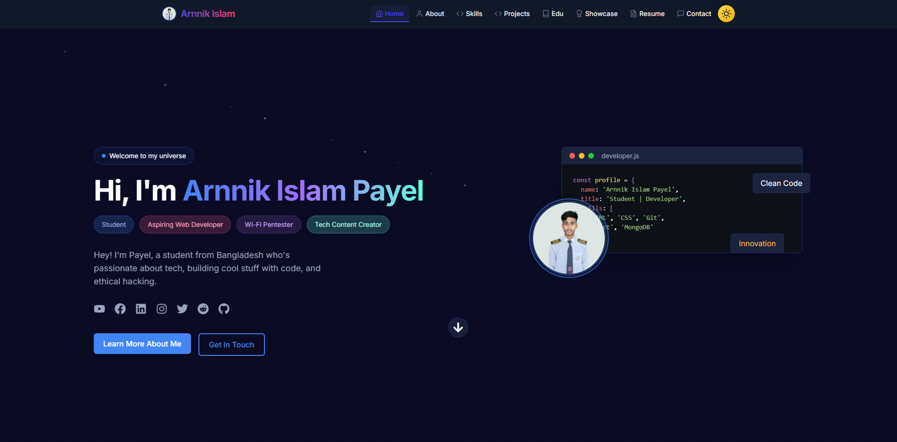

# 🚀 Arnnik Islam Payel – Personal Portfolio



🌐 **Live Website :** [arnnikislam.vercel.app](https://arnnikislam.vercel.app)

[](https://arnnikislam.vercel.app/)
[](https://github.com/arnnikislam/AI-folio)
[](LICENSE)
[](https://nextjs.org/)
[](https://www.typescriptlang.org/)
[](https://tailwindcss.com/)
[](https://www.framer.com/motion/)
[](https://vercel.com/)
[](https://nodejs.org/)
[](https://www.npmjs.com/)


A modern, high-performance developer portfolio built with **Next.js**, **TypeScript**, and **Tailwind CSS**. Showcasing my projects, skills, blogs, and professional presence with a sleek, responsive, and accessible UI.

---

## ✨ Key Features

- 🎨 Elegant, modern UI design  
- 🌗 Light & Dark mode toggle  
- 📱 Fully responsive on all devices  
- ⚡ Optimized performance with Next.js  
- 🎬 Smooth page transitions with Framer Motion  
- 🔍 SEO optimized for better reach  
- 📝 Blog section for writing and tutorials  
- 🧠 Skills section with animated progress indicators  
- 📂 Project showcase with category filtering  
- 📧 Contact form integrated with EmailJS  

---

## 🛠️ Tech Stack

| Category       | Technologies                                  |
|----------------|-----------------------------------------------|
| **Framework**  | Next.js 14                                     |
| **Language**   | TypeScript                                     |
| **Styling**    | Tailwind CSS                                   |
| **Animations** | Framer Motion                                  |
| **Icons**      | React Icons                                    |
| **Forms**      | React Hook Form + EmailJS                      |
| **Deployment** | Vercel                                         |

---

## 🚀 Getting Started

Follow these steps to run the project locally:

```bash
# Clone the repository
git clone https://github.com/arnnikislam/AI-folio.git

# Navigate into the project directory
cd AI-folio

# Install the dependencies
npm install
```

### 🔐 Set Up Environment Variables

Create a `.env.local` file in the root directory and add your [EmailJS](https://www.emailjs.com/) credentials:

```env
NEXT_PUBLIC_EMAILJS_PUBLIC_KEY=your_emailjs_public_key
NEXT_PUBLIC_EMAILJS_TEMPLATE_ID=your_template_id
NEXT_PUBLIC_EMAILJS_SERVICE_ID=your_service_id
```

### ▶️ Run the Development Server

```bash
npm run dev
```

Visit [http://localhost:3000](http://localhost:3000) in your browser.

---

## 📁 Project Structure

```
AI-folio/
├── src/
│   ├── app/               # Next.js app routes
│   │   ├── (routes)/      # Pages: about, projects, blog, etc.
│   ├── components/        # Reusable UI components
│   ├── data/              # Static data: projects, skills, etc.
│   ├── lib/               # Utility functions
│   ├── styles/            # Global styles and themes
│   └── types/             # TypeScript type definitions
├── public/                # Public assets
├── .env.local             # Environment variables
├── next.config.js         # Next.js configuration
├── tailwind.config.js     # TailwindCSS configuration
├── package.json           # Dependencies and scripts
└── README.md              # Project documentation
```

---

## 🎨 Customization Guide

Make it your own by updating:

- `src/data/personalInfo.ts` – Your name, bio, social links  
- `src/data/skills.ts` – Your skill list and progress  
- `src/data/projects.ts` – Add your personal or team projects  
- `src/data/blog.ts` – Write and manage blog content  
- `tailwind.config.js` – Update colors, fonts, spacing, etc.  

---

## 🚢 Deployment (via Vercel)

Deploy your own copy in just a few clicks:

1. Fork this repository  
2. Go to [vercel.com](https://vercel.com) and create a new project  
3. Link your forked GitHub repository  
4. Add the environment variables  
5. Hit **Deploy**

---

## 🤝 Contributing

Got a suggestion or found a bug? Feel free to:

- Open an issue  
- Submit a pull request  
- Share feedback  

Contributions are always welcome ❤️

---

## 📄 License

This project is licensed under the **MIT License**.  
See the [LICENSE](LICENSE) file for more information.

---

## 📬 Contact

Got questions or ideas?  
Use the [Contact Form](https://arnnikislam.vercel.app/contact) on the site, or open an issue here on GitHub.

---

## 🙌 Acknowledgments

- 👤 Profile content sourced from [Arnnik Islam's GitHub](https://github.com/arnnikislam)  
- 🎨 Design inspiration from modern portfolio trends and open-source creators  
- 💡 Special thanks to the open-source community for the amazing tools that made this project possible  
- 🤖 AI tools used: [Cursor AI](https://cursor.ai) & [Windsurf AI](https://windsurf.ai) for creative support  

---

## 🌐 Connect with Me

[](https://linkedin.com/in/arnnikislam)  
[](https://youtube.com/@learnwitharnnik)  
[](https://github.com/arnnikislam)
